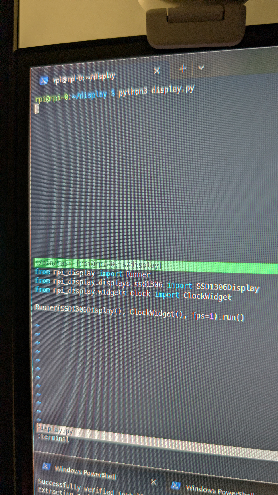
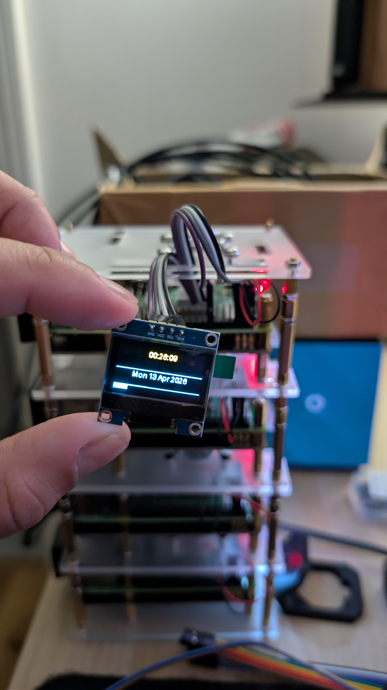

## 1. The Original Inspiration

This project started with an article by **Michael Klements** on The DIY Life: [Add an OLED Stats Display to Raspberry Pi OS Bookworm](https://the-diy-life.com/add-an-oled-stats-display-to-raspberry-pi-os-bookworm/). The article walks through connecting a small SSD1306 OLED display to a Raspberry Pi and writing a Python script that shows live system statistics (CPU usage, memory, disk, temperature, and IP address).

The original script, available at [github.com/mklements/OLED_Stats](https://github.com/mklements/OLED_Stats), is a clear and working piece of code. It does exactly what it says on the tin. For a single-purpose stats screen, it is perfectly fine.

But the more I looked at the script, the more I noticed a pattern I have seen in many embedded display projects: the same boilerplate repeated everywhere. Every example in the repo wires up `busio.I2C`, initializes `adafruit_ssd1306.SSD1306_I2C`, creates a `PIL.Image`, sets up `ImageDraw`, and then tears it all down at the end. If you want to show something different on the screen like a clock, a network status, an animation you will need to write almost the same scaffolding again from scratch.

That made me want to build something better.

---

## 2. What I Built Instead

The result is `rpi-display-core`: a small Python framework for SSD1306 and SH1106 OLED displays on the Raspberry Pi. The goal was to eliminate all the display boilerplate and replace it with a clean, composable API.

Instead of wiring up I2C every time you want to show something, you write:

```python
from rpi_display.displays.ssd1306 import SSD1306Display
from rpi_display import Runner
from rpi_display.widgets.clock import ClockWidget

Runner(SSD1306Display(), ClockWidget()).run()
```

That is it. Four lines. A running clock on the OLED display.



The framework provides:

- Specialized display classes for SSD1306 and SH1106 backends
- A `canvas` context manager that gives you a `PIL.ImageDraw` surface and automatically flushes it to the display on exit
- A `Widget` base class with a consistent `render(draw, x, y)` interface
- A `Runner` class that drives a render loop at a fixed FPS
- A `MockDisplay` for testing without hardware
- Multiple built-in widgets covering the most common display use cases

The framework is available on PyPI, has a full pytest suite, and includes examples such as a `systemd` service so you can run your display as a persistent background service.

The repository is at: [https://github.com/andremmfaria/rpi-display-core](https://github.com/andremmfaria/rpi-display-core)

---

## 3. Hardware You'll Need

The hardware side of this project is minimal. You need a Raspberry Pi, a small OLED display, and four jumper wires.

- **[Raspberry Pi](https://amzn.to/3OrRngj)** — any Pi with I2C support will work. (The Pi 5 is the current recommended board, but i used an Rpi 4b for this)
- **[Raspberry Pi Power Supply](https://amzn.to/40WQ9RS)** — the official USB-C power supply for the Pi
- **[32GB MicroSD Card](https://amzn.to/40Q1Dq8)** — any class-10 card works; 32GB is more than enough
- **[I2C OLED Display 128×64](https://amzn.to/4i3Nvjd)** — the 0.96-inch SSD1306 module or 1.3-inch SH1106 module, four pins (GND, VCC, SCL, SDA)
- **[4-Wire Female-to-Female Jumper Cables](https://amzn.to/4fr4Dh7)** — for connecting the display to the GPIO header

The framework supports both SSD1306 and SH1106 I2C displays. SPI variants are out of scope.

---

## 4. Wiring It Up

The OLED module connects directly to the Raspberry Pi GPIO header using four wires. No breadboard required.

| OLED Pin | Pi Header Pin | Description |
|----------|---------------|-------------|
| GND      | Pin 9         | Ground      |
| VCC      | Pin 1         | 3.3V power  |
| SCL      | Pin 5         | I2C clock   |
| SDA      | Pin 3         | I2C data    |

Before running anything, I2C must be enabled on the Pi. Use `raspi-config` → Interface Options → I2C, or add `dtparam=i2c_arm=on` to `/boot/firmware/config.txt`. After enabling I2C, verify the display is detected:

```bash
i2cdetect -y 1
```

You should see `3c` appear in the output grid, which is the default I2C address for SSD1306 and SH1106 displays.

---

## 5. Installing the Framework

The framework is available on PyPI and can be installed using `uv`:

```bash
uv add rpi-display-core
```

You can find the project on PyPI at: <https://pypi.org/project/rpi-display-core>

The `adafruit-blinka`, `adafruit-circuitpython-ssd1306`, and `adafruit-circuitpython-sh1106` packages provide the I2C and display drivers. `pillow` handles image composition. The `rpi-display-core` package itself manages these dependencies for you.

To verify the installation:

```bash
python -c "from rpi_display.displays.ssd1306 import SSD1306Display; from rpi_display import canvas, Widget, Runner; print('ok')"
```

---

## 6. Core Concepts

The framework has four building blocks: `Display` backends, `canvas`, `Widget`, and `Runner`.

### Display Backends

The framework provides specialized classes for different display controllers. Hardware imports are deferred inside `__init__`, so the module can be imported on any machine without crashing.

```python
from rpi_display.displays.ssd1306 import SSD1306Display
from rpi_display.displays.sh1106 import SH1106Display

display = SSD1306Display()    # default: address=0x3C, 128×64
# OR
# display = SH1106Display()
display.clear()              # fill with black and flush
```

### canvas

`canvas` is a context manager that creates a fresh `PIL.Image` and `ImageDraw`, yields the draw surface, and then flushes the image to the display on exit, even if an exception is raised inside the block.

```python
from rpi_display.displays.ssd1306 import SSD1306Display
from rpi_display import canvas
from PIL import ImageFont

display = SSD1306Display()
with canvas(display) as draw:
    font = ImageFont.load_default()
    draw.text((10, 20), "Hello, World!", font=font, fill=255)
```

This pattern comes directly from [luma.oled](https://luma-oled.readthedocs.io/), which uses the same `with canvas(device) as draw` idiom.

### Widget

`Widget` is the base class for all display components. Every widget implements a single method:

```python
def render(self, draw, x: int = 0, y: int = 0) -> None:
    raise NotImplementedError
```

The `draw` argument is a `PIL.ImageDraw.ImageDraw`. The `x` and `y` offsets let you position widgets anywhere on the 128×64 canvas.

### Runner

`Runner` drives the render loop. It accepts either a `Widget` instance or a plain callable, and calls it at a fixed FPS:

```python
from rpi_display.displays.ssd1306 import SSD1306Display
from rpi_display import Runner
from rpi_display.widgets.system import SystemStatsWidget

Runner(SSD1306Display(), SystemStatsWidget(), fps=1).run()
```

The loop runs until interrupted. A `try/finally` block ensures `display.clear()` is always called on exit, leaving the screen blank rather than frozen on the last frame.

---

## 7. Built-in Widgets

The framework ships several widgets out of the box.

### Text

`Text` renders a single line of text at a given position and font size. `MultiLineText` renders a list of strings as stacked lines with configurable spacing. `ScrollingText` scrolls a string horizontally across the screen, advancing by a configurable number of pixels per render call.

```python
from rpi_display.widgets.text import Text, MultiLineText, ScrollingText

Text("Hello").render(draw, 0, 0)
MultiLineText(["Line 1", "Line 2", "Line 3"]).render(draw, 0, 0)
ScrollingText("This is a long message that scrolls...", speed=3).render(draw, 0, 50)
```

All three widgets load DejaVu Sans from `/usr/share/fonts/truetype/dejavu/DejaVuSans.ttf` when available, and fall back to the PIL bitmap font otherwise.

### ProgressBar

`ProgressBar` draws a filled rectangle representing a value between 0.0 and 1.0. Values outside that range are clamped at construction time.

```python
from rpi_display.widgets.shapes import ProgressBar

ProgressBar(0.72, label="CPU").render(draw, 0, 26)
```

### ClockWidget

`ClockWidget` shows the current time in large type, a horizontal divider, the date in smaller type below, and an optional seconds progress bar at the bottom of the screen. It reuses `ProgressBar` internally for the seconds indicator.



### SystemStatsWidget

`SystemStatsWidget` is a composite widget that stacks five individual sub-widgets in a column:

- `IpWidget` — local IP address via `hostname -I`
- `CpuWidget` — CPU usage via `/proc/stat` two-snapshot method
- `RamWidget` — memory usage via `free -m`
- `DiskWidget` — disk usage via `df -h`
- `TempWidget` — CPU temperature via `/sys/class/thermal/thermal_zone0/temp`

Each sub-widget fetches its data fresh on every `render()` call and returns `"N/A"` if the data source is unavailable, rather than raising an exception.

The CPU widget deliberately avoids `top -bn1` because it is slow and creates its own CPU load. Reading `/proc/stat` twice with a 0.1-second gap gives an accurate idle-time delta at a fraction of the cost.

### NetworkWidget

`NetworkWidget` shows the hostname, local IP, and internet reachability (a 1-second ping to 8.8.8.8). All three lookups are wrapped in exception handlers and return graceful fallback values on failure.

### Spinner

`Spinner` cycles through `|`, `/`, `-`, `\` characters, advancing one frame per `render()` call. The caller controls speed by adjusting the Runner's FPS.

---

## 8. A Complete Example

Here is a full script using `SystemStatsWidget` with `Runner`. This is also what the systemd service example uses:

```python
from rpi_display.displays.ssd1306 import SSD1306Display
from rpi_display import Runner
from rpi_display.widgets.system import SystemStatsWidget

Runner(SSD1306Display(), SystemStatsWidget(), fps=1).run()
```

When the script runs, it updates the display once per second with the current IP, CPU, RAM, disk, and temperature. Press `Ctrl+C` to stop. The display clears cleanly on exit.

For testing without a physical display, swap in `MockDisplay`:

```python
from rpi_display import Runner
from rpi_display.mock import MockDisplay
from rpi_display.widgets.system import SystemStatsWidget

d = MockDisplay()
Runner(d, SystemStatsWidget(), fps=10).run()
# d.last_image holds the most recent PIL Image after each render
```

---

## 9. Running as a systemd Service

For a persistent display that survives reboots, create a systemd unit file that runs `examples/09_systemd_service.py`. That script runs `SystemStatsWidget` at 1 FPS and is designed to be the entry point for a service.

Create `/etc/systemd/system/rpi-display.service` with the following contents, replacing `YOUR_USERNAME` and the path to match your installation:

```ini
[Unit]
Description=rpi-display-core stats display
After=network.target

[Service]
User=YOUR_USERNAME
WorkingDirectory=/home/YOUR_USERNAME/rpi-display-core
ExecStart=uv run python examples/09_systemd_service.py
Restart=on-failure

[Install]
WantedBy=multi-user.target
```

Then enable and start it:

```bash
sudo systemctl daemon-reload
sudo systemctl enable rpi-display
sudo systemctl start rpi-display
```

`Restart=on-failure` means a clean exit (e.g. `Ctrl+C` in a terminal) will not trigger a restart. Only unexpected crashes will.

To check logs:

```bash
journalctl -u rpi-display -f
```

If the service restarts repeatedly, the most common cause is the display not being detected. Run `i2cdetect -y 1` to confirm `3c` appears.

---

## 10. Development Workflow

If you want to contribute to the project, I use `uv` for development. The following commands are used for linting, formatting, and testing:

```bash
uv run ruff check .
uv run ruff format --check .
uv run black --check .
uv run isort --check-only .
uv run mypy
uv run pytest
```

---

## 11. Future Improvements

The framework covers the common cases for I2C OLED displays, but there are a number of directions it could grow.

- **Support for additional display controllers**: Potential future display backends include SPI displays and e-ink panels.
- **Additional widgets**: I am considering adding `BitmapWidget` for rendering 1-bit PNG or BMP files and a `QRCodeWidget` for generating codes on the fly.
- **Enhanced scrolling**: The `ScrollingText` widget currently wraps at the end of the text. Supporting bidirectional bounce scrolling is a planned improvement.

---

## Conclusion

Starting from Michael Klements' original stats display script, this project built a composable Python framework that replaces display boilerplate with clean abstractions. The specialized display classes, `canvas`, `Widget`, and `Runner` primitives cover the full rendering lifecycle, and the built-in widgets handle the most common display use cases.

The framework is available on PyPI at <https://pypi.org/project/rpi-display-core>, is fully tested, and is designed for production use on the Raspberry Pi.

The repository is available at: [https://github.com/andremmfaria/rpi-display-core](https://github.com/andremmfaria/rpi-display-core)

Credits:

- Original article: [Add an OLED Stats Display to Raspberry Pi OS Bookworm](https://the-diy-life.com/add-an-oled-stats-display-to-raspberry-pi-os-bookworm/) by Michael Klements
- Original repo: [github.com/mklements/OLED_Stats](https://github.com/mklements/OLED_Stats)
