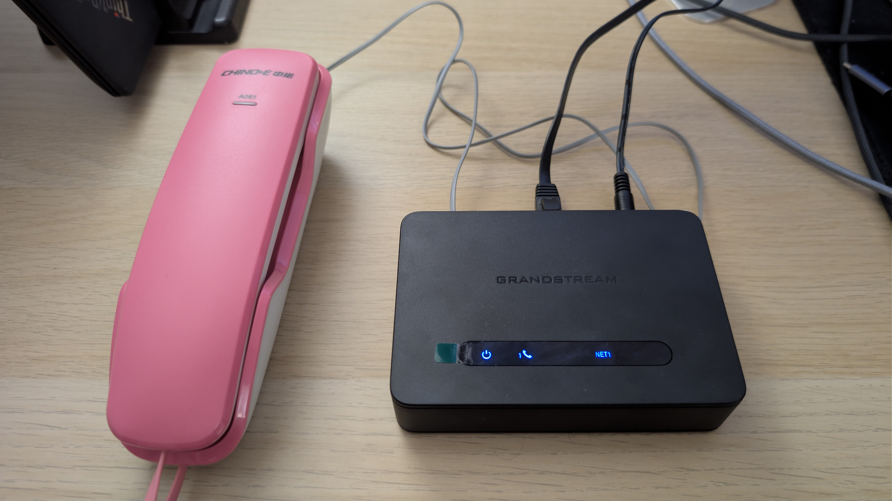
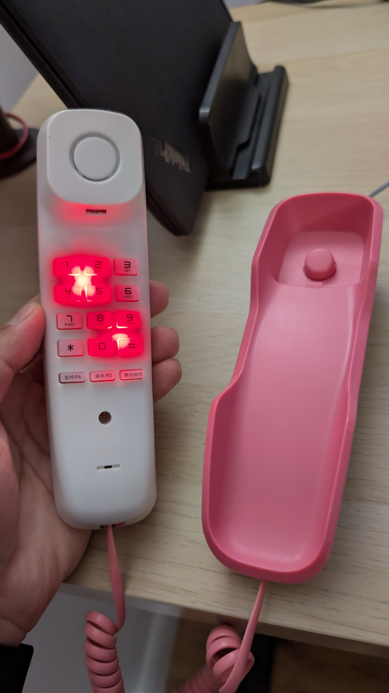
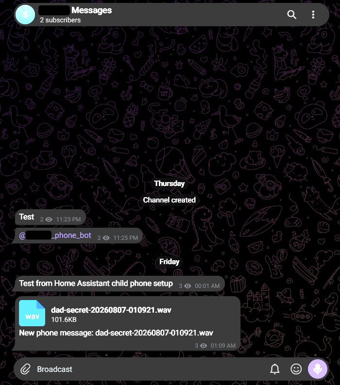

This started, as too many projects do, with me watching Instagram Reels. I came across [this Reel](https://www.instagram.com/reel/DZuj9SehAhE) about someone who had bought a [Tin Can](https://tincan.kids/products/tin-can) phone for her daughter, and the shape of it immediately appealed to me. A familiar physical interface, a modern backend, no apps, no games, and very little nonsense exposed to the child.

The bit that got me was the quick-dial trick. If a child-friendly phone can call specific numbers, those numbers do not have to be normal phone numbers. They can be internal service codes. If those codes reach a PBX, pressing a physical button can do something other than place a call. Like running code or triggering an automation, with the correct harness.

My first instinct was to build the whole system myself. I was going to run the service within my Home Assistant host [as I have done before](https://github.com/andremmfaria/ha-wiimote-bridge). But then I found [Asterisk](https://www.asterisk.org/) through the [TECH7Fox Asterisk Home Assistant add-on](https://github.com/TECH7Fox/asterisk-hass-addons) and companion [Asterisk Home Assistant integration](https://github.com/TECH7Fox/asterisk-hass-integration). That made the project useful in some ways. I could learn telephony, automate stuff around the house, give my son a screenless interface to those automations, and, to boot, let him communicate with his parents. That changed the plan from writing a small phone system to configuring a real PBX.

So the design became almost disappointingly old-fashioned.

```text
big-button analogue phone
  -> VoIP ATA
  -> Asterisk
  -> Home Assistant
  -> Telegram
```

The phone itself stays dumb. That is the point.



## The phone is not the brain

An RJ11 analogue phone does not understand VoIP, Home Assistant, Telegram, automations, or routing. It expects a telephone line to provide dial tone, line voltage, ringing, and an audio path.

That is useful. A simple phone is robust, familiar, and child-friendly. The [physical interface is the feature](https://dl.acm.org/doi/10.1145/258549.258715). The intelligence lives behind it, in two layers.

- an **ATA**, which pretends to be a landline
- a **PBX**, which decides what each dialled digit means

ATA means analogue telephone adapter. For this build, the important detail is that it needs an **FXS** port. FXS is the port that powers an analogue phone. FXO is the opposite: it connects to a real landline. The one I got is the [Grandstream HT812 V2](https://www.grandstream.com/products/gateways-and-atas/analog-telephone-adaptors/product/ht812v2), which I bought [from Amazon Ireland](https://www.amazon.ie/dp/B0BL1CXL27).

The phone I bought was a big-button analogue handset also from [Amazon Ireland](https://www.amazon.ie/dp/B0DV1TKG96). As far as I understand, this can be done with any analogue phone that has an RJ11 connector. The HT812 has two FXS ports, which is more than I need for one phone but useful for testing or a second handset later. The [HT818](https://www.grandstream.com/products/gateways-and-atas/analog-telephone-adaptors/product/ht818) also exists, but that has eight FXS ports. Lovely if you are building a small hotel phone system. Mildly ridiculous for one child phone.

## The working version

This is not a full family PBX. I deliberately built the local, default-deny core before adding a SIP trunk for external calls.

Right now the phone is a one-digit interface.



```text
1 = record a message for Dad
2 = record a message for Mum
3 = play a short "Wheels on the Bus" clip
4 = emit a Home Assistant trigger event
5 = emit a Home Assistant trigger event
6 = reserved trigger stub
7 = reserved trigger stub
8 = reserved trigger stub
9 = play a test prompt
```

The child does not need to know those numbers. The physical buttons get labels or photos. The backend maps each digit to a fixed action.

So pressing a button is not really "dialling a number". It is triggering a controlled workflow.

```text
button press -> ATA -> Asterisk -> local action
```

That is the architectural trick. Do not make the phone clever. Make the backend clever. There is a decent body of work around [tangible interaction for children](https://www.mmi.ifi.lmu.de/pubdb/publications/pub/liyanhong2021cc/liyanhong2021cc.pdf), which is the academic way of saying that sometimes a real object beats another glowing rectangle.

There is also something pleasingly ridiculous about the whole thing. Most of the useful ideas here are old. Not "[last framework cycle](https://www.herodevs.com/blog-posts/sunsetting-a-framework-lessons-from-angularjs)" old, proper old. PBXs, extension routing, [tone signalling](https://www.itu.int/rec/T-REC-Q.23-198811-I/en), recorded prompts, call contexts. This is roughly seventy-year-old territory in computing terms, which makes it the Triassic. I am not inventing a new interaction model so much as bolting Home Assistant onto very settled telephony ideas and letting them do what they were always good at.

## Configuring the ATA

The HT812 is configured through its own web UI. It works, but it is enormous. Grandstream exposes a frightening amount of telephony machinery in there, including SIP profiles, codec order, DTMF behaviour, dial plans, NAT settings, provisioning, certificates, call features, and a swamp of P-values. Useful, but not exactly a child-friendly interface for the adult either.

For this build, only a small slice mattered. Profile 1 points at the Home Assistant Asterisk add-on as the SIP server. FXS port 1 uses `child-phone` as both the SIP user ID and authenticate ID. The password matches the Asterisk `pjsip_custom.conf` secret. DTMF uses [RFC 4733](https://datatracker.ietf.org/doc/html/rfc4733), and the dial plan is `{ xS0 }`, which sends a single digit immediately to Asterisk.

The full ATA walkthrough [lives in the companion repository as a guide](https://github.com/andremmfaria/child-phone/blob/main/config/HT812V2/README.md). That is where the web UI details belong, because copying the whole thing into the article would be cruel and not especially useful.

## Configuring Asterisk

### Asterisk does the routing

The ATA registers to Asterisk as a SIP endpoint called `child-phone`. Asterisk runs inside Home Assistant using the TECH7Fox Asterisk add-on. If you want the grown-up version of this idea, GÉANT has a useful guide to [implementing an IP telephone exchange using Asterisk](https://archive.geant.org/projects/gn3/geant/services/cbp/Documents/cbp-19_implementing-an-ip-telephone-exchange-using-asterisk.pdf).

The add-on creates two useful config directories.

```text
/addon_configs/<asterisk_addon_slug>/asterisk/default
/addon_configs/<asterisk_addon_slug>/asterisk/custom
```

The `default` directory is regenerated by the add-on. Treat it as reference material. Durable edits go in `custom`.

For this project, these are the important custom files.

```text
pjsip_custom.conf
extensions.conf
manager.conf
indications.conf
modules.conf
```

One small Asterisk/PJSIP detail cost me time. The working setup uses `child-phone` as both the SIP username and the AOR name. Renaming the AOR to something tidy like `child-phone-aor` broke registration with an `AOR '' not found for endpoint 'child-phone'` error. Sometimes the ugly name is the correct name. Telephony has opinions and we know none of them.

This is the trimmed shape of the PJSIP config.

```ini
[child-phone-auth]
type=auth
auth_type=userpass
username=child-phone
password=CHANGEME_CHILD_PHONE_SECRET

[child-phone]
type=aor
max_contacts=1
remove_existing=yes
remove_unavailable=yes
qualify_frequency=30

[child-phone]
type=endpoint
transport=transport-udp
context=child-phone
disallow=all
allow=alaw
allow=ulaw
aors=child-phone
auth=child-phone-auth
callerid="Child Phone" <201>
dtmf_mode=rfc4733
```

The important bit is that the AOR block and the endpoint block are both named `child-phone`. PJSIP distinguishes them by `type`, and the endpoint points back to that AOR with `aors=child-phone`. The full config, including the identify block and the rest of the project files, is in the [Asterisk guide in the companion repo](https://github.com/andremmfaria/child-phone/blob/main/config/asterisk/README.md).

### Default deny, because children press buttons

The safety model matters more than the telephony. The child phone must not inherit a normal outbound dial plan. In Asterisk, the endpoint is assigned to a dedicated context called `child-phone`, and that context only contains explicit actions. The real dialplan has this shape.

```asterisk
[child-phone]
exten => 1,1,Answer()
 same => n,Gosub(child-phone-trigger,s,1(1))
 same => n,Playback(/media/asterisk/sounds/custom/leave-dad-secret)
 same => n,Playback(beep)
 same => n,Record(/media/asterisk/messages/dad-secret-${STRFTIME(${EPOCH},,%Y%m%d-%H%M%S)}.wav,0,0,xk)
 same => n,Hangup()

exten => 2,1,Answer()
 same => n,Gosub(child-phone-trigger,s,1(2))
 same => n,Playback(/media/asterisk/sounds/custom/leave-mom-secret)
 same => n,Playback(beep)
 same => n,Record(/media/asterisk/messages/mom-secret-${STRFTIME(${EPOCH},,%Y%m%d-%H%M%S)}.wav,0,0,xk)
 same => n,Hangup()

exten => 3,1,Answer()
 same => n,Gosub(child-phone-trigger,s,1(3))
 same => n,Playback(/media/asterisk/sounds/custom/wheels-on-the-bus)
 same => n,Hangup()

exten => _X!,1,NoOp(REJECTED child-phone dial attempt: ${EXTEN})
 same => n,Congestion(3)
 same => n,Hangup()

[child-phone-trigger]
exten => s,1,UserEvent(ChildPhoneButton,Source: child-phone,Button: ${ARG1})
 same => n,Return()
```

That last `_X!` rule is important. It rejects everything that has not been explicitly defined. There is no fallback like "if it looks like a number, send it to the trunk".

The ATA also has a digit map, but in the current build it is intentionally simple. It only improves button behaviour by sending a single digit immediately. The Asterisk context is the real security boundary. The ATA makes the phone feel responsive; the PBX decides what is allowed.

## Recording a message is just another extension

The message feature does not need a separate product.

Asterisk writes recordings here.

```text
/media/asterisk/messages
```

Prompt audio lives here.

```text
/media/asterisk/sounds/custom
```

When my son presses `1`, Asterisk answers, emits a `ChildPhoneButton` AMI event, plays a custom prompt, plays a beep, and records until hang-up. Button `2` does the same for his mum.

The flow looks like this.

```text
child presses button 1
phone sends digit to HT812
HT812 sends SIP call to Asterisk
Asterisk records dad-secret-YYYYMMDD-HHMMSS.wav
Home Assistant sees the completed file
Home Assistant sends the WAV to Telegram
```

The nice thing about this design is that Asterisk does not need to know about Telegram. It records audio. Home Assistant handles delivery.

## Home Assistant watches for completed files

The recording delivery path uses Home Assistant's Folder Watcher integration.

The watcher uses this configuration.

```text
Folder: /media/asterisk/messages
Pattern: *.wav
```

The automation listens for the `closed` event, not the `created` event.

```yaml
triggers:
  - trigger: event
    event_type: folder_watcher
    event_data:
      event_type: closed
conditions:
  - condition: template
    value_template: >
      {{ trigger.event.data.path is string
         and trigger.event.data.path.startswith('/media/asterisk/messages/')
         and trigger.event.data.path.endswith('.wav') }}
```

That detail matters. Asterisk creates the WAV file before the recording is finished. If Home Assistant sends the file on `created`, it can race the recorder and upload a partial recording. The `closed` event fires after Asterisk has finished writing.

The action is just `telegram_bot.send_document`.

```yaml
action: telegram_bot.send_document
data:
  file: "{{ trigger.event.data.path }}"
  caption: "New phone message: {{ trigger.event.data.file }}"
```

The bot token stays in Home Assistant. The repository contains config templates and examples, not live secrets.

## Telegram delivery

The Telegram side is intentionally small. I created a bot through BotFather, following Telegram's official [bot creation tutorial](https://core.telegram.org/bots/tutorial#obtain-your-bot-token), then created a private broadcast channel for the phone messages and added the bot there. Home Assistant only needs the bot token and the destination chat. The first test was a plain text message from Home Assistant. The real test was a completed WAV recording landing in the same channel.



## Home Assistant and Asterisk

There is a useful Home Assistant ecosystem around this already. The project I used is the TECH7Fox Asterisk add-on. It runs Asterisk inside Home Assistant and exposes the real Asterisk configuration files under the add-on config directory. There is also a HACS Asterisk integration that connects to Asterisk over AMI, the Asterisk Manager Interface. That can expose device state, registration state, connected line, DTMF events, and a generic `send_action` service for AMI commands like `Ping`, `Originate`, or `Hangup`.

There was one catch. With the current add-on/integration setup, quick-dialling a Home Assistant action directly is not quite a first-class path yet. Asterisk can emit AMI `UserEvent`s from its call routing, but the Home Assistant integration did not forward those events into Home Assistant as normal events. I opened [TECH7Fox/asterisk-hass-integration PR #126](https://github.com/TECH7Fox/asterisk-hass-integration/pull/126) to add that. I also opened [TECH7Fox/asterisk-hass-addons PR #453](https://github.com/TECH7Fox/asterisk-hass-addons/pull/453) to make AMI network access configurable, so Home Assistant can connect without loosening access more than necessary.

For this build, I split responsibilities this way.

- **Asterisk add-on** - the actual PBX and routing engine
- **Asterisk integration** - monitoring and Home Assistant event/control bridge

I do not make the Home Assistant integration the core path for child button behaviour. That belongs in Asterisk itself. It is lower-level, more deterministic, and less likely to break because a Home Assistant custom integration changed an entity model. Home Assistant should observe and react. Asterisk should decide what a dialled digit means.

## What I Made

The core build is not a full telephone system. It is a local, default-deny phone interface with a handful of deliberately boring behaviours.

| Dialled input            | Behaviour                                                    |
| ------------------------ | ------------------------------------------------------------ |
| `1`                    | Play Dad prompt, beep, record WAV                            |
| `2`                    | Play Mum prompt, beep, record WAV                            |
| `3`                    | Play "Wheels on the Bus" clip                                |
| `4`                    | Emit`ChildPhoneButton` event and hang up                   |
| `5`                    | Emit`ChildPhoneButton` event and hang up                   |
| `6`, `7`, `8`      | Emit event, play three beeps, hang up                        |
| `9`                    | Play test prompt                                             |
| random multi-digit input | Reject with congestion                                       |
| `999` / `112`        | Reject unless emergency support is intentionally implemented |

The HT812 registers successfully as `child-phone`. Asterisk reports the endpoint as reachable. Recording works. Home Assistant sees completed WAV files and can deliver them to Telegram. That makes the current build useful without pretending it is a normal telephone.

## The emergency-call problem

There is one uncomfortable detail. This thing looks like a landline. That means everyone in the house may assume it can call emergency services. If it cannot call `999` or `112`, that needs to be explicit. If it can, then emergency support becomes a proper requirement.

- SIP provider support for Irish emergency calls
- correct caller ID
- registered location/address handling
- UPS for ATA, PBX, switch, router, and internet handoff
- tested routing
- fallback if internet or power is down

I am not pretending it is an emergency phone. It is a family communication device and should be labelled accordingly. Half-supporting emergency calls is worse than not supporting them. It creates confidence where there should be caution.

## Privacy is part of the build

Recorded child voice messages are private data. The plumbing is simple enough that it is easy to forget that, and research on [internet-connected toys that listen](https://techpolicylab.uw.edu/wp-content/uploads/2017/10/Toys-That-Listen_CHI-2017.pdf) is a useful reminder that child audio should be treated as sensitive by default. For this setup, I use these rules.

- recordings go only to a private parent-controlled Telegram destination
- bot tokens and chat IDs stay in Home Assistant secrets/config, not in the public repo
- live SIP, AMI, Home Assistant, and Telegram credentials are never committed
- recordings should have a retention policy rather than piling up forever
- failure should be visible because a missed upload should not silently disappear

The build works. The next hardening step is operational rather than architectural, retention, monitoring, and backup/restore of the ATA and Asterisk config.

## The build, in one page

The current version looks like this.

```text
big-button RJ11 phone
  -> Grandstream HT812 V2 FXS port
  -> Asterisk Home Assistant add-on
  -> child-phone context
  -> local recordings and AMI UserEvents
  -> Home Assistant Folder Watcher / automations
  -> Telegram delivery for completed WAV files
```

The source config lives here.

- [github.com/andremmfaria/child-phone](https://github.com/andremmfaria/child-phone)

This can still become an actual phone later. The missing commercial piece is a SIP trunk from a provider such as [VoIPLine Ireland](https://www.voipline.ie/sip-trunking), which lists SIP lines from around EUR 1 per channel per month, with numbers purchased separately. That would let Asterisk place and receive calls through the ordinary phone network.

It keeps the child-facing device physical and boring, which is exactly what I want. All the complexity stays in software, where it can be inspected, backed up, changed, and locked down. Sometimes the right smart device is a dumb device with a better backend.
