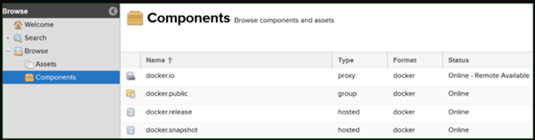

## Continuous integration with containers and inceptions

How to create a CI system using container recursion and how to create a CI system using container recursion

As many of you already know, containers are something of wonder. They exist since the old days of computing in a concept called [OS-level virtualization](https://en.wikipedia.org/wiki/OS-level_virtualization). Since then, for their flexibility, they have been used in an orchestrated manner by many awesome tools, like [Kubernetes](https://kubernetes.io/), [DC/OS](https://dcos.io/), [Apache Mesos](http://mesos.apache.org/) and many more. This provides not only an abstraction layer on OS-Level but also enables a great deal of automation where there was none before.

I used the [Semantic Versioning](https://semver.org/) but you can easily replace this for any versioning patterns that you like. E.g., [Calendar Versioning](https://calver.org/) or any [other](https://en.wikipedia.org/wiki/Software_versioning).

I am now going to show you a model of continuous integration (CI) with some "inception".

Disclaimer:  
This article assumes you have some knowledge about versioning, CI, CD, containers and orchestration, along with the tooling associated with those concepts.

## Tools

For code versioning we will be using the so popular [Git](https://git-scm.com/) on [GitHub](https://github.com/). You can use pretty much any versioning system in the market with this, I only used git for familiarity. And GitHub for popularity.

[Jenkins](https://jenkins.io/) is an orchestration tool first devised for CI, but since the creation of the [pipeline plugin](https://wiki.jenkins.io/display/JENKINS/Pipeline+Plugin) it has become more of a general-purpose orchestrator.

The docker project, or just [Docker](https://www.docker.com/), is a very neat application that lets you manage containers in a easy and inexpensive way using their command line and API.

For container registry I used [Nexus](https://www.sonatype.com/nexus-repository-sonatype). The free version is quite nice and is more than enough to everything we need. It has a plugin for storage on [Amazon's S3](https://aws.amazon.com/s3/) which makes your storage *virtually* limitless. (Use at your own discretion)

Note1: For container storage you can use any registry available in applications like [Artifactory](https://jfrog.com/artifactory/) but you can also use cloud services like [AWS's ECR](https://aws.amazon.com/ecr/), [AZURE's Container Registry](https://azure.microsoft.com/en-us/services/container-registry/) or [GCP's Container Registry](https://cloud.google.com/container-registry/).

Note2: There are many other steps you can input on the pipeline for testing, validation, hardening, etc. But I will be covering only the general steps of the pipeline, like code checkout, container pull, app build, container build and container storage.

## Model

Some time ago I made a presentation on this topic on a meetup that happened in São Paulo - Brazil. The slides for that presentation can be found [here](https://slides.com/andremmfaria/inception#/).


This model outlines the basic actors and actions made on the process. The orchestrator, in our case Jenkins, contacts the container engine's, in our case Docker, API over TCP and creates the build container. Then it connects to a random SSH port directly on the build container. From there, the orchestrator has a few workflows based on the build workflow. The workflows on this model build two structures, the app container and other container builders.

## Structures

This section shows the results of the mentioned workflows.

### Container builds container builders (Recursions are always nice :D)

The build container is a specialized image that is built specifically to build other things, among them other build containers.

* [Linux definition](https://github.com/andremmfaria/linux-dind-build-image)
* [Windows definition](https://github.com/andremmfaria/windows-dind-build-image)

From this image, the orchestrator pulls container definitions for specific application languages/build engines, like [Java/gradle](https://github.com/andremmfaria/java-build-image), [c#/.NETcore](https://github.com/andremmfaria/netcore-build-image) or [javascript/npm](https://github.com/andremmfaria/angular-build-image), builds and stores them onto the container registry.

### Container builds app containers

From the definitions outlined above, the applications can be built from a container specific for their case. I will be using java's case as an example. It should be similar for other cases.

Jenkins provides a nice way to bundle pipelines definitions, among other actions, using [shared libraries](https://www.jenkins.io/doc/book/pipeline/shared-libraries/). Those are basically [Groovy](https://groovy-lang.org/) scripts and exist to extend Jenkins functionality.

* [Multi-build shared library](https://github.com/andremmfaria/jenkins-shared-lib-multiple-build)
* [Java build image definition](https://github.com/andremmfaria/java-build-image)
* [Java definition on the shared lib](https://github.com/andremmfaria/jenkins-shared-lib-multiple-build/blob/7e1a8b3921fdfa8e51966ed9e394628afe1b2050/vars/buildApplication.groovy#L5)

You also need to have a Jenkinsfile on your code's repo for it to know which app engine is to be used for the build. Here is an example Jenkinsfile:

```groovy
@Library('execPipeline') _

def config = [:]
config.'engine' = 'java'
config.'type' = 'app'

execPipeline(config)
```

Those are the configurations the pipeline needs to know where to go.

### Configuration

These are the configurations for each tool. This might change a bit overtime but the documentation is (or should) be always true.

#### Jenkins

As stated, above Jenkins is using shared libraries. Its config is fairly simple, you just input the git repo for the shared lib on the config and you're good to go. I used the global shared lib definitions for this example. The full steps can be found [here](https://www.jenkins.io/doc/book/pipeline/shared-libraries/#retrieval-method).

Jenkins also talks to docker on a remote host for the container's management. You need to install a docker plugin and configure it properly. The steps on Jenkins's plugin side can be found [here](https://plugins.jenkins.io/docker-plugin/). On the docker's side you can follow [these steps](https://docs.docker.com/engine/reference/commandline/dockerd/#daemon-socket-option) to enable remote access using various methods.

This assumes that you are using [Jenkins multibranch pipelines](https://plugins.jenkins.io/workflow-multibranch/) to create your pipeline's definition. From this, just input your Git repo on the multibranch pipeline and it should roll out by itself.
You can follow this example to configure everything: [Build a multibranch pipeline project](https://www.jenkins.io/doc/tutorials/build-a-multibranch-pipeline-project/)

#### Nexus

Configuring Nexus is easy. Just install it following the [official documentation](https://help.sonatype.com/repomanager3/installation) and make sure you have storage space. You'll need it.

Set up repositories as you feel like. You can separate per environment (gamma, beta, prod, etc), per app engine type (java, node, .net core, etc), both or none. A good recommendation is to separate each artefact repository on a different port. E.g.: beta repo on port 5000, gamma repo on port 5001, etc.

#### Docker

Depending on your situation Docker's installation and usage, is be "easy". I mean, if your infrastructure still uses windows for a .net framework app, I feel sorry for you but this method still works.

For Linux you can follow [this guide](https://docs.docker.com/engine/install/#server). For windows you can follow [this one](https://docs.docker.com/docker-for-windows/install/). For mac… well… simply don't.

#### Git

You don't need any specific configuration on git's side. Just make sure that Jenkins can clone your repository and your repository contains the Jenkinsfile mentioned in section 3.2 of this article. If both are good, you're golden.

### Conclusion


After these configurations are setup, you will see the pipelines for each branch rollout, and your nexus registry being populated with your app containers.



Thanks for reading this article till the end. Have a nice day/afternoon/evening :D
