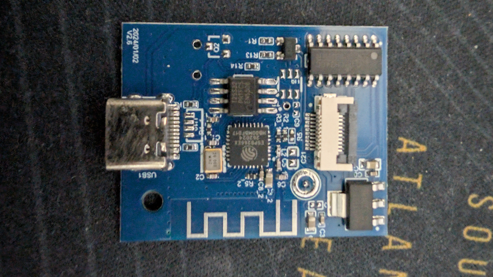
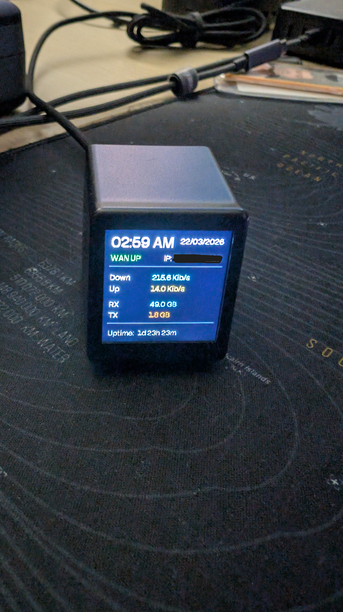

## 1. The Unexpected Device

I wasn’t trying to build anything.

I just wanted a desk clock. Something small, clean, and with Wi-Fi so it would always have the correct time. No tinkering and no dashboard.

What I ended up buying was the [GeekMagic Ultra](https://geekmagic.com/products/geekmagic-ultra-4) on Amazon. The ad marketed it as a generic “smart weather clock,” which sounded close enough to what I needed. The design is nice, the screen is sharp, and on paper it looks like a slightly more capable version of a normal digital clock.


Out of the box, that is what it feels like. You connect to its own Wi-Fi network, use the web interface to join your normal Wi-Fi, and get a polished little display for time, weather, and a few widgets. Then something feels off.

The customization is limited. You can change what is displayed, but not how it works. That usually means the hardware is either heavily locked down or far more capable than the software allows. In this case, it was the latter.

Once you dig a bit deeper, you realize this is not really a smart clock at all. It is an ESP8266 with a 240×240 display attached to it. No magic, no proprietary silicon, just a familiar microcontroller in a nicely packaged form factor.

That realization changes the entire perspective. Because if it’s an ESP8266:

* it can be reflashed
* it can run ESPHome
* it can integrate directly with Home Assistant

At that point, it stops being a product and starts being a platform. What I thought was a simple desk accessory turned out to be a small, hackable display node that fits into a home automation setup. Not by design, but by accident.

## 2. Peeling It Open

Once you accept that the device is hackable, the next step is understanding what you are actually working with. In this case, that means ignoring the marketing and looking at the hardware.



In this device's case, the chip is soldered on the board with the other components and cannot be removed easily. Otherwise, the device is very simple:

* an ESP8266
* a 240×240 ST7789 TFT display
* SPI wiring between them
* a PWM-controlled backlight


There is no extra compute layer, no buffering chip, no hidden abstraction. Everything you draw goes straight through the ESP8266 to the display. That simplicity is both the reason this works and the reason it can fail so easily.

The ESP8266 is capable, but constrained. You are working with little usable RAM, no PSRAM, and a heap that can become unstable if pushed too far. A 240×240 screen sounds small, but it still needs memory to render properly.

That creates the core tension. The display wants memory, and the ESP8266 does not have much of it. The natural instinct is to allocate buffers, use large fonts, and redraw frequently. On this device, that leads straight to crashes, boot loops, or a screen that flickers black.

The wiring itself also comes with a few quirks. Through community reverse engineering, the common mapping looks like this:

* `GPIO14` → SPI clock
* `GPIO13` → SPI MOSI
* `GPIO0` / `GPIO2` → display control (DC / RESET)
* `GPIO5` → backlight (PWM)

This mapping is also referenced by the GeekMagic owner in [issue #4 of the smalltv repository](https://github.com/GeekMagicClock/smalltv/issues/4), where they shared the same pin definitions for the device (`TFT_DC=0`, `TFT_RST=2`, `SCK=14`, `MOSI=13`, `TFT_BL=5`, `TFT_CS=-1`).

One detail that catches people off guard is the lack of a proper chip select line. Because of that, the display only behaves correctly when the SPI bus is configured in `mode3`. This is not documented anywhere official. The community figured it out by trial and error.

That pattern repeats across the device. Nothing here is particularly complex, but almost nothing is documented either. You do not have the headroom to brute-force problems. Every buffer size, font size, and update interval affects stability. Once you understand those constraints, the device becomes predictable and surprisingly capable.

## 3. Community Reverse Engineering

If you try to approach this device using only official documentation, you won’t get very far.

There is no proper datasheet for the product as a whole, although there is a [GitHub repository](https://github.com/GeekMagicClock/smalltv-ultra) with some manuals. There is no supported ESPHome configuration and no clear description of how the display is wired internally. What exists instead is a trail of people experimenting, breaking things, and slowly converging on what works.

The starting point for me was a [YouTube video from Maker HQ](https://www.youtube.com/watch?v=S1Q9PZ95SDM), which provides a basic working configuration and links to a [working config file](https://www.dropbox.com/scl/fi/9t175rsb23n8anikfplcg/ultratv.yaml?rlkey=au79zg7flndf2dz2g2uq598v4&e=1&dl=0). Without it, the display parameters become a guessing game.

The real work happened in the [forum thread on the Home Assistant Community](https://community.home-assistant.io/t/installing-esphome-on-geekmagic-smart-weather-clock-smalltv-pro/618029).

One important detail matters for context. The hardware shown in post #8 of that thread is exactly the same as my unit, which places mine in the clone or counterfeit variant discussed there rather than the official SmallTV Ultra hardware.

That thread is long, messy, and full of partial solutions, but it is also where most of the important details were uncovered.

A few of the key findings that came out of that effort:

* The display works reliably only with `spi_mode: mode3`
* The newer `mipi_spi` driver behaves better than older alternatives
* `color_depth: 8` is effectively mandatory on ESP8266
* Full buffering is not viable, partial buffers must be used
* Small mistakes in configuration lead to hard crashes, not soft failures

None of these are obvious if you only read ESPHome documentation. They become clear when you see multiple people hitting the same issues. There is not one correct configuration. There are working configurations, and they depend on trade-offs:

* stability vs visual quality
* buffer size vs responsiveness
* font size vs memory usage

That is why copying a YAML file blindly often does not work. Small differences, even something like a slightly larger font, can push the device over the edge. In this case, the community did not just provide examples. It effectively reverse engineered the device through collective experimentation.

Huge thanks to [MakerHQ](https://www.youtube.com/@Maker_HQ) for the walkthrough, and to everyone in the [Home Assistant forum thread](https://community.home-assistant.io/t/installing-esphome-on-geekmagic-smart-weather-clock-smalltv-pro/618029) who shared tests, pin mappings, and working configs.

## 4. Connect, Flash, and Configure

If you have the same hardware revision I got, the process is easier than many guides suggest.

I did not need to solder anything at all. Flashing worked by simply plugging the device into my computer over USB and using the ESPHome web flasher.

Here is the exact flow that worked for me:

1. Connect the device to your computer with a USB cable.
2. Open [https://web.esphome.io/](https://web.esphome.io/) in a Chromium-based browser (Chrome, Edge, Brave, etc.).
3. Click **Connect**, then select the serial device that appears for the clock.
4. Install ESPHome onto the device from the web installer.
5. Wait for the first boot to complete, then join the temporary Wi-Fi AP created by the device if prompted.
6. Join the ap through your phone or something, enter the webpage on the device and configure the WiFi connection to your network.
7. Provide your Wi-Fi credentials so the device can join your network.
8. Add it to Home Assistant and upload your YAML configuration.
9. Reboot once after the first successful upload and confirm that the display renders correctly.

One important browser caveat. Firefox did not work for me because this flow depends on Web Serial support, which is available in Chromium-based browsers.

If you prefer to follow a visual walkthrough, there is also a step-by-step in the [MakerHQ video](https://www.youtube.com/watch?v=S1Q9PZ95SDM).

After this initial flash, updates are much easier because you can usually do OTA uploads from ESPHome without reconnecting USB.

## 5. ESPHome and Home Assistant

Once the display is stable, the problem shifts to what it should show.

In my case, the answer was straightforward. I wanted a simple network status panel that still functioned as a desk clock.

The architecture ended up being simple, given that I already had the UniFi integration in Home Assistant:

```text
UniFi Dream Machine → Home Assistant → ESPHome → Display
```

The key decision here was to let Home Assistant do all the heavy lifting.

Instead of pushing data via MQTT or building custom logic on the ESP8266, I used the `homeassistant:` platform in ESPHome to pull values directly. That means the device is not calculating anything complex. It is just rendering whatever Home Assistant already knows.



The data flowing into the display includes:

* WAN status (up/down)
* External IP address
* Total data received and sent
* Current download and upload speeds
* Uptime

All of these come from existing Home Assistant entities. The ESP reads them and turns them into text on the screen, which keeps the system simple and stable.

Take a look at the result in this gist <https://gist.github.com/andremmfaria/7d060df2771cc90815e220d1a5440b85>

There are still a few transformations that need to happen locally, but they are lightweight:

* Uptime arrives as raw seconds → converted into days/hours/minutes
* Byte counters → converted into KB/MB/GB for readability
* Speed values → relabeled to match expected units

Nothing here is computationally heavy. It is mostly formatting, which matters because the ESP8266 does not have much headroom. The more logic you move out of it, the more reliable the system becomes.

Rendering is done using a display lambda, updated every 15 seconds. That interval is deliberate. Faster updates are possible, but they start to introduce timing warnings and unnecessary load.

Another small but important choice was avoiding unnecessary state. The device does not cache values, track deltas, or maintain history. It redraws the current state each cycle. If Home Assistant updates, the display reflects it. If the ESP reboots, it reconnects and resumes.

No synchronization problems, no drift, no edge cases. In the end, the ESP8266 is not acting like a smart device. It is acting like a very small, very focused display terminal for Home Assistant.

## 6. The UI

Once everything is wired and talking properly, the next question is simple. What should this actually look like?

A 240×240 screen sounds like enough space, but it fills up quickly. Add the ESP8266 limitations, limited RAM, slow redraws, and occasional watchdog warnings, and you are designing inside a tight box.

You cannot treat this like a modern UI. There is no room for heavy layouts, large assets, or frequent updates. Even small changes, like increasing font sizes or adding extra text, can affect performance.

The final structure ended up being simple and functional:

```text
[ TIME            DATE ]
[ WAN STATUS      IP   ]
-----------------------
[ Down / Up            ]
[ RX / TX              ]
-----------------------
[ Uptime               ]
```

The time is the primary element, so it gets the largest font and the most visual weight. The date sits opposite it, using the same horizontal space to balance the layout without competing for attention.

Below that, the WAN status and IP address are split across the screen. This was a deliberate choice. Keeping them on the same line but on opposite sides avoids clutter while still grouping related information together.

The middle section is purely data, with download and upload speeds, then total received and transmitted data. These are aligned in a predictable way, so your eyes do not need to search. Labels on the left, values on the right.

At the bottom, uptime sits on its own, separated by a line. It’s useful, but not something you need to glance at constantly, so it gets the least visual emphasis.

The biggest trade-offs showed up in small details:

* Large fonts improve readability, but reduce available space
* Right-aligned text looks better, but is slightly more expensive to render
* Frequent updates feel “live,” but increase CPU load

Even color choices matter. Bright colors for data, white for labels, and muted tones for separators keep the information readable at a glance. There are no images or complex graphics. Everything is drawn using basic primitives, text, lines, and simple shapes because those are cheaper to render and more stable over time.

The end result is not flashy, but it does not need to be. It is fast enough, stable enough, and clear enough to do its job.

## 7. What This Became (and Why It’s Better Than a Clock)

I set out to get a clock. What I ended up with is a small, always-on display that reflects the state of my network in real time.

A clock is passive. It shows time, maybe the weather, and that is it. This device, once integrated with Home Assistant, becomes part of the system. It reacts to changes, reflects status, and gives you information you did not realize you wanted in that form.

Right now, it shows:

* time and date
* WAN status
* external IP
* live bandwidth usage
* total traffic
* uptime

Because it’s running ESPHome, it can be extended in any direction:

* flash the screen when WAN goes down
* display alerts or notifications
* switch between different pages of data
* integrate other sensors from Home Assistant
* react to events instead of just polling

None of that requires changing the hardware. It is all software.

What makes this particularly interesting is how accidental it is. The device was not designed to be used this way. It just exposes enough of its internals to make it possible. That is a recurring pattern with products that sit between consumer electronics and development boards. Most people use them as intended. A few people look inside and realize they can do much more.

It is still sitting on my desk, still acting as a clock. But now it is also a live view into my network, something I can glance at without opening a dashboard or checking an app.

Not because it’s more complex, but because it’s more useful.
