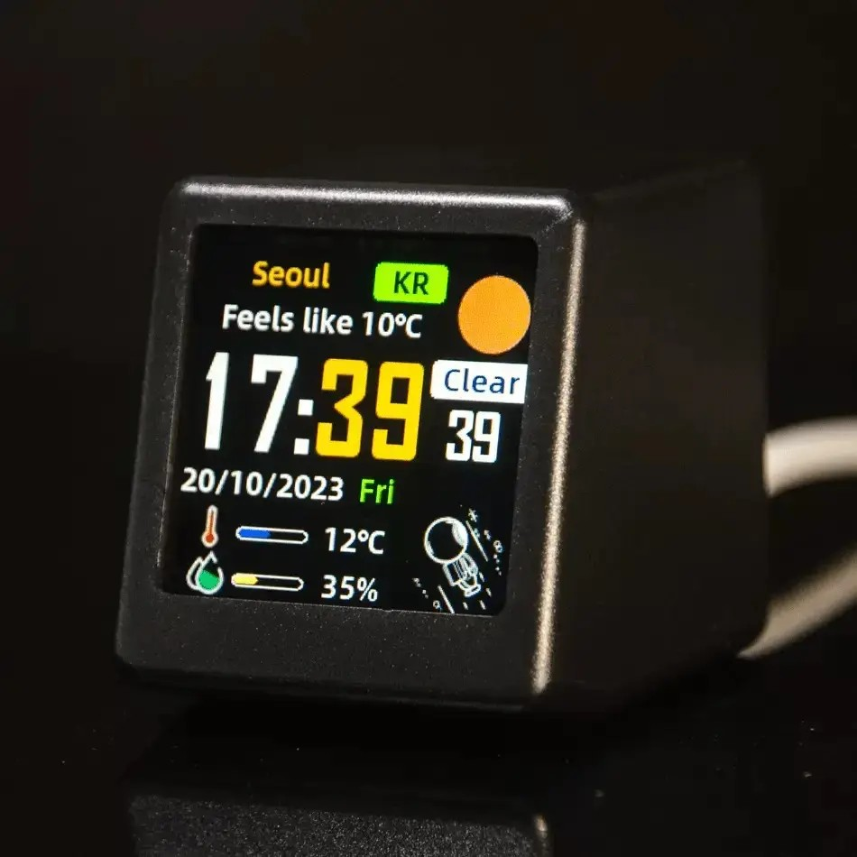
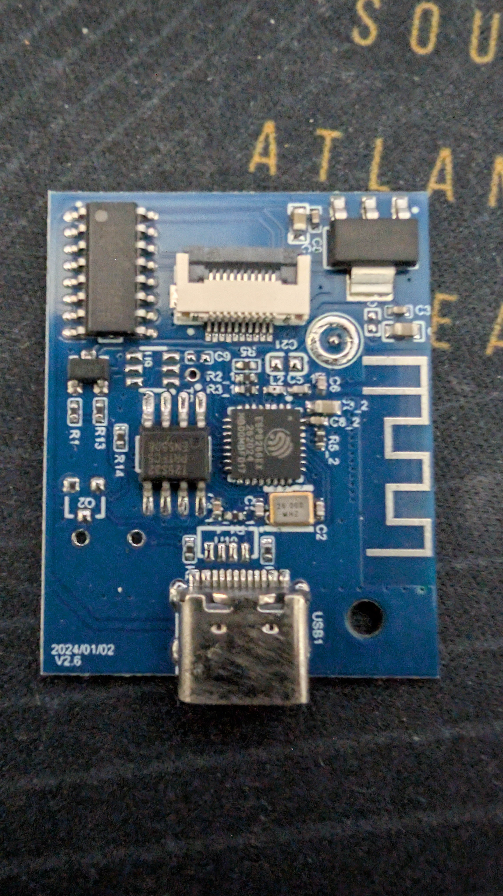

## 1. The Unexpected Device

I wasn’t trying to build anything.

I just wanted a desk clock. Something small, clean, and with Wi-Fi so it would always have the correct time. No tinkering, no integrations, no dashboards. Just something I could plug in, place on my desk, and forget about.

What I ended up buying was the [GeekMagic Ultra](https://geekmagic.com/products/geekmagic-ultra-4) on Amazon. The ad marketed it as a generic “smart weather clock,” which sounded close enough to what I needed. The design is nice, the screen is sharp, and on paper it looks like a slightly more capable version of a normal digital clock.



Out of the box, that’s exactly what it feels like. You connect to it using its own Wi-Fi network, then it provides you with a web interface so you can configure it to connect to your Wi-Fi. It shows time, weather, and a few widgets, and generally behaves like a polished consumer device. But after a few minutes of using it, something feels off.

The customization is limited. You can change what’s displayed, but not how it works. It’s flexible in appearance, but rigid in behavior. That’s usually a sign that the hardware underneath is either heavily locked down or far more capable than the software allows. In this case, it was the latter.

Once you dig a bit deeper, you realize this isn’t really a “smart clock” at all. It’s an ESP8266 with a 240×240 display attached to it. That’s it. No magic, no proprietary silicon. Just a very familiar microcontroller in a nicely packaged form factor.

That realization changes the entire perspective. Because if it’s an ESP8266:

* it can be reflashed
* it can run ESPHome
* it can integrate directly with Home Assistant

At that point, it stops being a product and starts being a platform.

What I thought was a simple desk accessory turned out to be a small, hackable display node that fits perfectly into a home automation setup. Not by design, but by accident.

---

## 2. Peeling It Open: Hardware Reality

Once you accept that the device is hackable, the next step is understanding what you’re actually working with. And in this case, that means ignoring the marketing entirely and looking at the hardware.





Internally, the device is very simple:

* an ESP8266
* a 240×240 ST7789 TFT display
* SPI wiring between them
* a PWM-controlled backlight

There’s no extra compute layer, no buffering chip, no hidden abstraction. Everything you draw goes straight through the ESP8266 to the display. That simplicity is both the reason this works and the reason it can fail so easily.

The ESP8266 is a capable chip, but it is also extremely constrained. You are working with a small amount of usable RAM, no PSRAM, and a heap that can become unstable if pushed too far. On the other side, the display is not trivial. A 240×240 screen sounds small, but it still requires a meaningful amount of memory to render properly.

That creates a constant tension:

> the display wants memory, and the ESP8266 does not have much of it.

This is why so many initial attempts fail. The natural instinct is to treat it like a modern embedded system, allocate buffers, use large fonts, redraw frequently. On this device, that approach leads straight to crashes, boot loops, or a screen that just flickers black.

The wiring itself also comes with a few quirks. Through community reverse engineering, the common mapping looks like this:

* `GPIO14` → SPI clock
* `GPIO13` → SPI MOSI
* `GPIO0` / `GPIO2` → display control (DC / RESET)
* `GPIO5` → backlight (PWM)

One detail that catches people off guard is the lack of a proper chip select line. Because of that, the display only behaves correctly when the SPI bus is configured in a specific mode (`mode3`). This is not documented anywhere official, it’s something the community figured out by trial and error.

And that pattern repeats across the entire device.

Nothing here is particularly complex, but almost nothing is documented either. Every working configuration is the result of small discoveries layered on top of each other.

The important takeaway is that this is not a forgiving platform. You don’t have the headroom to brute-force your way through problems. Every decision, buffer size, font size, update interval, has a direct impact on stability.

Once you understand those constraints, the device becomes predictable and surprisingly capable. Until then, it just looks like it’s broken.

---

## 3. The Real Work: Community Reverse Engineering

If you try to approach this device using only official documentation, you won’t get very far.

There is no proper datasheet for the product as a whole (although there is a [GH repo](https://github.com/GeekMagicClock/smalltv-ultra) with some manuals). There is no “supported ESPHome configuration.” There isn’t even a clear description of how the display is wired internally. What exists instead is a long trail of people experimenting, breaking things, and slowly converging on what works.

The starting point for me was a [YouTube video from Maker HQ](https://www.youtube.com/watch?v=S1Q9PZ95SDM), which provides a basic working configuration. This video was really useful because it gave me a [working config file as a starting point](https://www.dropbox.com/scl/fi/9t175rsb23n8anikfplcg/ultratv.yaml?rlkey=au79zg7flndf2dz2g2uq598v4&e=1&dl=0). Without it, the proper way to set the display parameters becomes a guessing game. It gets the screen to light up and things to render, but it doesn’t explain why certain settings matter or what happens when you deviate from them.

The real work happened in the [forum thread on the Home Assistant Community](https://community.home-assistant.io/t/installing-esphome-on-geekmagic-smart-weather-clock-smalltv-pro/618029/7).

That thread is long, messy, and full of partial solutions, but it’s also where most of the important details were uncovered. Not in a single place, but spread across dozens of posts. You don’t read it linearly, you piece it together.

A few of the key findings that came out of that effort:

* The display works reliably only with `spi_mode: mode3`
* The newer `mipi_spi` driver behaves better than older alternatives
* `color_depth: 8` is effectively mandatory on ESP8266
* Full buffering is not viable, partial buffers must be used
* Small mistakes in configuration lead to hard crashes, not soft failures

None of these are obvious if you just look at ESPHome documentation. They only become clear when you see multiple people hitting the same issues and gradually narrowing down the causes. Another important detail is that there isn’t a single “correct” configuration. There are working configurations, but they depend on trade-offs:

* stability vs visual quality
* buffer size vs responsiveness
* font size vs memory usage

That’s why copying a YAML file blindly often doesn’t work. Small differences, even something like a slightly larger font, can push the device over the edge.

Take a look at the result on my side: <https://gist.github.com/andremmfaria/7d060df2771cc90815e220d1a5440b85>

This is one of those cases where the community didn’t just provide examples. It effectively reverse engineered the behavior of the device through collective experimentation. Without that, this would have been a dead end.

---

## 4. Making It Work: ESPHome + Home Assistant Integration

Once the display is stable, the problem shifts from “how do I make this work” to “what do I actually want it to show.”

In my case, the answer was straightforward: I wanted a simple network status panel that still functioned as a desk clock.

The architecture ended up being very simple, given that I already had the UniFi integration in Home Assistant:

```text
UniFi Dream Machine → Home Assistant → ESPHome → Display
```

The key decision here was to let Home Assistant do all the heavy lifting.

Instead of pushing data via MQTT or building custom logic on the ESP8266, I used the `homeassistant:` platform in ESPHome to pull values directly. That means the device is not calculating anything complex, it’s just rendering whatever Home Assistant already knows.


The data flowing into the display includes:

* WAN status (up/down)
* External IP address
* Total data received and sent
* Current download and upload speeds
* Uptime

All of these come from existing Home Assistant entities. The ESP simply reads them and turns them into text on the screen.

That approach keeps the system simple and, more importantly, stable.

There are still a few transformations that need to happen locally, but they are lightweight:

* Uptime arrives as raw seconds → converted into days/hours/minutes
* Byte counters → converted into KB/MB/GB for readability
* Speed values → relabeled to match expected units

Nothing here is computationally heavy. It’s mostly formatting. This is important, because the ESP8266 doesn’t have much headroom. The more logic you move out of it, the more reliable the system becomes.

Rendering is done using a display lambda, updated every 15 seconds. That interval is deliberate. Faster updates are possible, but they start to introduce timing warnings and unnecessary load. Slower updates keep things smooth and predictable.

Another small but important choice was avoiding unnecessary state. The device does not cache values, track deltas, or maintain history. It simply redraws the current state each cycle. That makes it effectively stateless:

* if Home Assistant updates, the display reflects it
* if the ESP reboots, it just reconnects and resumes

No synchronization problems, no drift, no edge cases. In the end, the ESP8266 isn’t acting like a smart device. It’s acting like a very small, very focused display terminal for Home Assistant. And that’s exactly what makes it work.

---

## 5. The UI: Constraints Drive Design

Once everything is wired and talking properly, the next question is simple: what should this actually look like?

That’s where the constraints start shaping everything.

A 240×240 screen sounds like enough space, but it fills up quickly. Add to that the ESP8266 limitations, limited RAM, slow redraws, and occasional watchdog warnings, and you’re not designing freely anymore. You’re designing within a tight box.

Early on, it becomes clear that you can’t treat this like a modern UI. There’s no room for heavy layouts, large assets, or frequent updates. Even small changes, like increasing font sizes or adding extra text, can have a noticeable impact on performance.

So the layout has to be intentional.

The final structure ended up being simple and functional:

```text
[ TIME            DATE ]
[ WAN STATUS      IP   ]
-----------------------
[ Down / Up            ]
[ RX / TX              ]
-----------------------
[ Uptime               ]
```

The time is the primary element, so it gets the largest font and the most visual weight. The date sits opposite it, using the same horizontal space to balance the layout without competing for attention.

Below that, the WAN status and IP address are split across the screen. This was a deliberate choice. Keeping them on the same line but on opposite sides avoids clutter while still grouping related information together.

The middle section is purely data:

* download and upload speeds
* total received and transmitted data

These are aligned in a predictable way, so your eyes don’t need to search. Labels on the left, values on the right. No surprises.

At the bottom, uptime sits on its own, separated by a line. It’s useful, but not something you need to glance at constantly, so it gets the least visual emphasis.

The biggest trade-offs showed up in small details:

* Large fonts improve readability, but reduce available space
* Right-aligned text looks better, but is slightly more expensive to render
* Frequent updates feel “live,” but increase CPU load

Even color choices matter. Bright colors for data, white for labels, muted tones for separators. Not for aesthetics alone, but to keep the information readable at a glance.

There’s also no use of images or complex graphics. Everything is drawn using basic primitives, text, lines, and simple shapes. Not because it looks better, but because it’s cheaper to render and more stable over time.

The end result isn’t flashy, but it doesn’t need to be. It’s fast enough, stable enough, and clear enough to do its job.

And on a device like this, that’s the real definition of a good UI.

---

## 6. What This Became (and Why It’s Better Than a Clock)

At some point, this stopped being about fixing a device and started becoming something else entirely.

I set out to get a clock. What I ended up with is a small, always-on display that reflects the state of my network in real time.

The difference is subtle, but important.

A clock is passive. It shows time, maybe the weather, and that’s it. This device, once integrated with Home Assistant, becomes part of the system. It reacts to changes, reflects status, and gives you information you didn’t realize you wanted in that form.

Right now, it shows:

* time and date
* WAN status
* external IP
* live bandwidth usage
* total traffic
* uptime

But that’s just a starting point.

Because it’s running ESPHome, it can be extended in any direction:

* flash the screen when WAN goes down
* display alerts or notifications
* switch between different pages of data
* integrate other sensors from Home Assistant
* react to events instead of just polling

None of that requires changing the hardware. It’s all software.

What makes this particularly interesting is how accidental it is. The device wasn’t designed to be used this way. It just happens to expose enough of its internals to make it possible.

That’s a recurring pattern with these kinds of products. They sit in a space between consumer electronics and development boards. Most people use them as intended. A few people look inside and realize they can do much more. This ended up being one of those cases.

It’s still sitting on my desk, still acting as a clock. But now it’s also a live view into my network, something I can glance at without opening a dashboard or checking an app. And that’s the part that makes it better.

Not because it’s more complex, but because it’s more useful.
