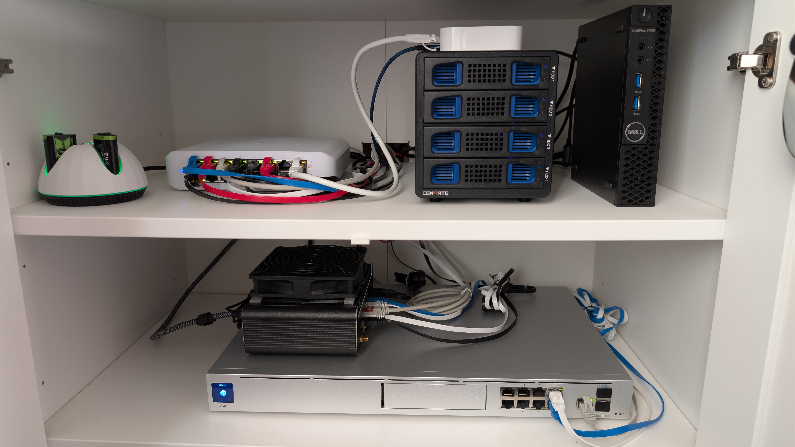
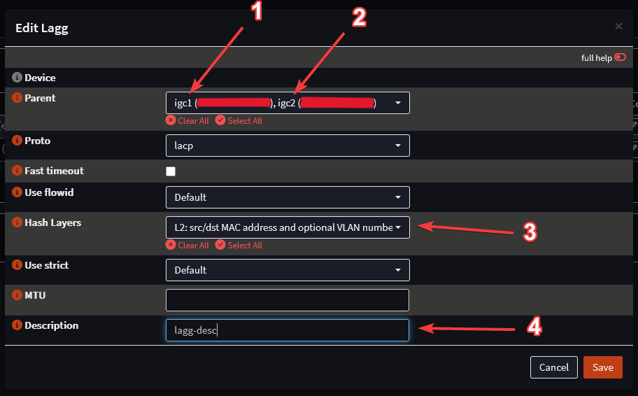
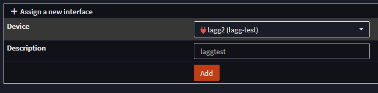
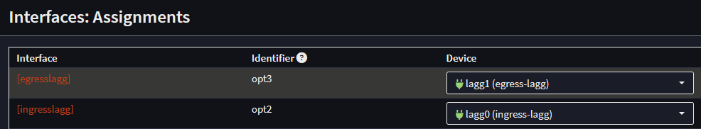
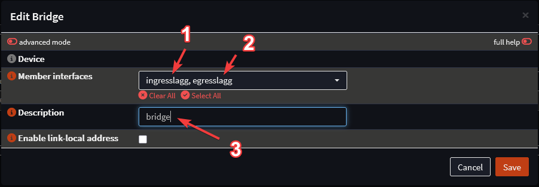
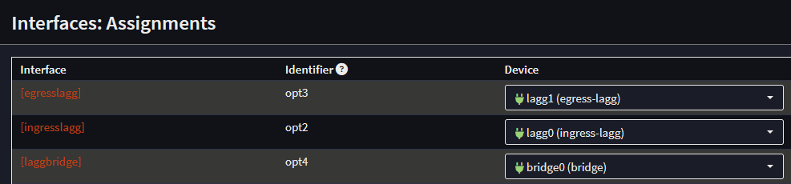
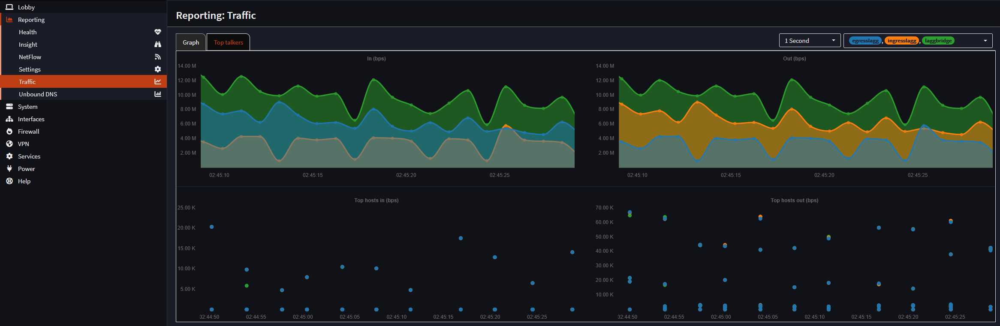

## Transparent LAGG (LACP) Bridge with OPNsense, UDM, and UniFi — A Practical Guide

## 1. Introduction

I have a pretty heavy network topology at my home. The result of years of IoT devices, user devices, servers and miscellaneous IP enabled things. Those pose some security threats that I longed to correct or, at the very least, monitor. So I had this idea to place a transparent firewall between my UniFi Dream Machine (UDM) and the rest of my network.

I wanted to do this without replacing/reconfiguring the UDM, without breaking VLANs, without touching DNS/DHCP or anything else other than what was really necessary. The goal was simple:

* perform minimal changes
* stay fully transparent to the network
* add filtering/inspection intelligence
* do it using **LAGG (LACP)** to increase throughput (and because it is cool).

This article documents how I built a **Layer 2–only transparent bridge** using OPNsense with two aggregated links toward the UDM and two aggregated links toward my UniFi switch. It also covers the mistakes I made so you don’t repeat them.

To set the stage, here is the physical setup as it exists today.



On the top shelf we have, from left to right, a pod charger for xbox controller batteries, the USW-16 we will be using for this guide, the BACKUP bay and a small application host. And on the bottom shelf we got the OPNSense box and the UDM.

That host and the BACKUP bay are part of a [Home Assistant](https://www.home-assistant.io/) installation I did with their [HAOS system](https://developers.home-assistant.io/docs/operating-system/). If you'd like to know more about it let me know.

### Sources

I followed these EXCELLENT guides in order to do this:

* **Video:**
  *How to Configure LAG-LACP*
  [https://www.youtube.com/watch?v=Rb4vlN_Hf-U](https://www.youtube.com/watch?v=Rb4vlN_Hf-U)

* **Article:**
  *Configure LAG/LACP on SFP Ports (TP-Link Example)*
  [https://homenetworkguy.com/how-to/configure-lag-lacp-on-sfp-ports-two-tp-link-switches-with-vlans/](https://homenetworkguy.com/how-to/configure-lag-lacp-on-sfp-ports-two-tp-link-switches-with-vlans/)

---

## 2. Network Topology

This entire design operates strictly at **Layer 2**. OPNsense is merely a bump-in-the-wire — it does not route, it does not NAT, and it does not participate in DHCP or DNS.

Those services remain entirely on the UDM:

* **UDM:** DNS, DHCP, routing, VLANs, firewall
* **OPNsense:** Transparent inline bridge with LACP
* **USW:** Downstream switching with LACP

### Traffic Flow

UDM → ingresslagg → laggbridge → egresslagg → UniFi Switch

Because the bridge sits inline and has no IP addresses assigned to it, the rest of the network behaves normally. All VLAN tags pass through untouched, and the UDM continues to see the whole network exactly as before.

---

## 3. System Setup (Hardware & Software Overview)

### Hardware Origin

This OPNsense box came to life after my old laptop suddenly died. Instead of throwing away perfectly good components, I salvaged:

* the **32 GB DDR4 RAM**,
* the **two SSDs** I later mirrored as RAID-1,
* and the **Wi-Fi card**,

and reused them inside a **barebones mini-PC** I purchased from [Amazon UK](https://www.amazon.co.uk/dp/B0BJQ1LX28).

The chassis ships without RAM or storage, making it ideal for a rebuild using recycled parts.

### System Specs

* **CPU:** Intel® Celeron® J6413 @ 1.80 GHz (4 cores / 4 threads)
* **RAM:** 32 GB DDR4-2166
* **Storage:** 128 GB SSD (RAID-1)
* **NICs:** 6 × Intel 1G
* **OS:** OPNsense **25.7.5-amd64**

And here is the firewall itself, with all six Ethernet interfaces populated:


---

## 4. Why Use LAGG in Transparent Mode?

I chose a transparent firewall because I wanted:

* **redundancy** — two links on each side, loss-tolerant
* **throughput headroom** — LACP distributes sessions across NICs
* **zero impact on existing network design** — no routing changes
* **full compatibility with UniFi** — VLANs, DHCP, and DNS remain untouched

### Layer 2 Only

This cannot be overstated:
**OPNsense in this setup is 100% Layer 2.**
It is not acting as a router, DHCP server, DNS resolver, or gateway.

It simply passes frames, while optionally filtering or inspecting them inline.

---

## 5. Configuring LAGG on OPNsense

On the OpnSense management web interface go to **Interfaces → Devices → LAGG**

There, two LAGGs are created:

| LAGG | Interface | Direction | Members |
| --- | --- | --- | --- |
| `ingresslagg` | `lagg0` | toward UDM | `igc1`, `igc2` |
| `egresslagg` | `lagg1` | toward UniFi Switch | `igc4`, `igc5` |

Click the "+" sign on the far right side of the table in the interface to add an entry. Repeat this for both entries on the table above.



1. Physical interface 1
2. Physical interface 2
3. Hash layer set for L2. Following the bump-in-the-wire approach.
4. Provide a meaningful description. Believe me, you will need it later.

Both LAGGs are configured in **LACP** mode. You can select more than 2 interfaces here, it only depends on how much interfaces you have. I only had 6 so in order to have a management interface (outside of the scope of this guide) i opted to have it be 2x2 (2 interfaces in and 2 interfaces out).

After this is set, it will look something like this:


Click apply.

Next, we need to create an interface from the newly created devices. Go to **Interfaces → Assignments** and assign a new interface to each of the devices on the *Assign a new interface* menu. Remember to provide a name in the description field. That will be the interface names.



Here we have **lagg-test** and **lagtest** but you can pretend that is either **ingress-lagg/egress-lagg** and **ingresslagg/egresslagg**. Click *add* to create it on the interfaces table like so:



Next, we need to add both interfaces to the bridge configuration. Go to **Interfaces → Devices → Bridge** and click the "+" sign on the far right side of the table in the interface to add an entry:



1. 1st LAGG interface
2. 2nd LAGG interface
3. GOOD description of what this device is.

Click *Save* to add it to the bridge interface table. From here, the newly created LAGG interfaces are added to a single bridge device. This device needs to be assigned to an interface by repeating the process we did for the lagg interface creation. After this is done, we have something like this:



After all of this is done, we now have **`laggbridge` = ingresslagg + egresslagg**.

Now, we enable the interfaces. After this is done, under the **Interfaces** menu, there should appear all interfaces we created (i.e. **laggbridge**, **ingresslagg**, **egresslagg**). Enable them all by clicking on each of the interface names under the **Interfaces** menu, check the *Enable* checkbox and click *Save*.

### Management and Services Interfaces

I host some services on this OPNSense box like DynamicDNS and AdGuard. The installation/management of those are outside of the scope of this article, but if you would like for me to write something about those, let me know.

These are independent interfaces I set with fixed IPs (on the UDM side). They stay **outside** of the bridge and ensure I can always reach OPNsense even if the bridge goes offline:

* `management` (`igc3`) → 192.168.1.x/24
* `services` (`igc0`) → 192.168.1.y/24

### ⚠️ Common mistakes to avoid

* **Don’t assign IPs to lagg0, lagg1, or the bridge:** Assigning IPs would make the bridge participate in Layer 3 (routing), breaking its transparent Layer 2 operation. This could disrupt network traffic, cause routing conflicts, and interfere with VLANs and DHCP.

* **Don’t enable the physical NICs individually, only the LAGGs:** Enabling NICs outside the LAGG group can cause duplicate connections, loops, or flapping, as the LAGG protocol expects to manage all member interfaces. This can destabilize the link aggregation and the bridge.

* **Don’t mix LACP Active/Passive between devices:** LACP requires both ends to be in compatible modes (usually Active). Mixing Active and Passive can prevent proper negotiation, causing the aggregated link to fail or operate unreliably.

* **Don’t skip a reboot, LAGG + bridge changes apply more cleanly afterward:** Network interface and bridge changes may not fully apply until after a reboot. Skipping this step can leave the system in a partially configured state, leading to unpredictable behavior or connectivity issues.

---

## 6. Configuring LACP on the UDM (Ingress Side)

The UDM handles the WAN, DHCP, DNS, routing, and VLAN assignments. In this setup, we only need it to expose **two LACP ports** toward the OPNsense box.

On the updated UniFi interface:

1. Go to **Settings → Profiles → Switch Ports**
2. Create a new **Aggregate** profile
3. Set **LACP Mode: Active**
4. Apply this profile to **ports 7 and 8** (or whichever pair you use)

Follow this very useful guide from [Hostify](https://support.hostifi.com/en/) if anything is not clear:

👉 <https://support.hostifi.com/en/articles/6454249-unifi-how-to-enable-link-aggregation-on-switches-lag>

Only after the profile is in place should you plug in the cables.


### ⚠️ Don’t #1 — Don’t plug cables in before creating the LACP group

UniFi auto-profiling may assign them to something else (like LAN, PoE, or VLAN-only), breaking negotiation.

### ⚠️ Don’t #2 — Don’t assume LACP comes up instantly

Give it **5–10 seconds** to negotiate.
If one side is up and the other is not, it will flap.

---

## 7. Configuring LACP on the UniFi Switch (Egress Side)

On the USW-16, the process is similar:

1. Open UniFi Controller → Devices → USW
2. Select **ports 7 and 8**
3. Click **Aggregate**
4. Set **LACP Active**
5. Save and wait for synchronization

These two ports will form the downstream side of the bridge.


### ⚠️ Don’t #3 — Don’t mix up NIC-to-port mapping

Label the NICs and cables before you start.
One swapped cable is enough to break the bundle or cause intermittent LACP flaps.

---

## 8. Testing the Transparent LAGG Bridge

Once everything is connected, verify the bridge and both LAGGs:

### On OPNsense

Run:

```shell
ifconfig lagg0
ifconfig lagg1
ifconfig laggbridge
```

You should see all LACP members in **ACTIVE** state.

### In the UniFi Controller

* UDM ports 7/8 should show **Aggregate — Active**
* USW ports 7/8 should show **Aggregate — Active**
* No errors, no flapping, no “Blocking” states

### Optional: Throughput Testing

You can run an `iperf3` test from a LAN device to something outside the bridge. Traffic should flow, no bottleneck should be observed and failover should work if you temporarily unplug one cable from each LAGG

### ⚠️ Don’t #4 — Don’t enable hardware offloading prematurely

Keep the following **disabled** until you verify stable operation:

* TSO
* LRO
* Checksum offload
* VLAN offload

Some Intel i225/i226 NICs misbehave with offloading in bridge mode.

---

## 9. Troubleshooting

Here are the most common issues — and their causes:

### **Issue: LAGG fails to negotiate**

* UDM or USW set to Passive instead of Active
* Cables on the wrong ports
* One side Active, the other Disabled
* An interface accidentally assigned directly instead of via LAGG

### **Issue: Bridge appears up but traffic drops**

* Hardware offloading left enabled
* A NIC is flapping or mismatched
* Member NIC enabled individually by mistake
* Duplicate MAC confusion (if using the same NIC model)

### **Issue: Network meltdown (loop)**

This is the most catastrophic one.

It happens when something like this occurs:

```text
UDM → OPNsense → USW
 ↑────────────────↓
  accidental loop
```

A single extra cable or an unconfigured LAGG member can create a broadcast storm.

### ⚠️ Don’t #5 — Don’t create a second path between UDM and USW

There must be **exactly one** traffic path:

```text
UDM → ingresslagg → laggbridge → egresslagg → USW
```

No more, no less.

---

## 10. Final Working Architecture

Once configured, the final architecture looks like this:

```text
          WAN
           │
        [ UDM ] Ports 7+8 (LACP Active)
          │  │
          ╰╮╭╯
          ingresslagg (lagg0)
           │
          [ laggbridge ]
           │
          egresslagg (lagg1)
          ╭╯╰╮
          │  │
        [ UniFi USW ] Ports 7+8 (LACP Active)
           │
         rest of LAN
```

Key properties:

* Fully **transparent Layer 2**
* No IPs on LAGGs or the bridge
* UDM retains all core services (DHCP, DNS, routing, VLANs)
* Redundant links on both sides
* Clean inline filtering option for OPNsense

---

## 11. Conclusion and results

Building a transparent bridge with LAGG on both sides is a great way to introduce a firewall into your network without redesigning the entire topology. OPNsense, combined with UniFi hardware, handles this setup surprisingly well — once everything is wired and configured correctly.

Along the way, I learned (the hard way) that LACP is extremely sensitive to:

* mismatched modes
* cable swaps
* auto-profiling quirks
* enabling NICs individually
* and forgetting to disable hardware offloading

But once the pieces fall into place, the result is a rock-solid, redundant inline bridge that just works.

With this setup you are able to see and/or filter EVERYTHING that is happening on your network (at least what passes through the bridge). You can set firewall rules for traffic that passes through the bridge and see cool graphs like this one:



This setup has a lot that can be improved upon. I am open for feedback and would love ideas on how to make this better. Leave a comment below and tell me what you think. Thank you!!!
