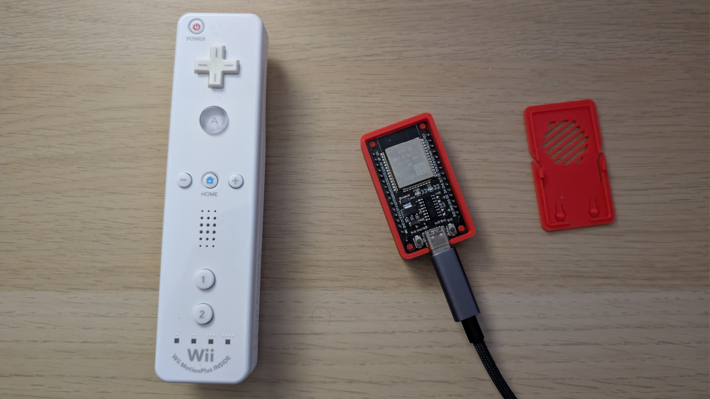
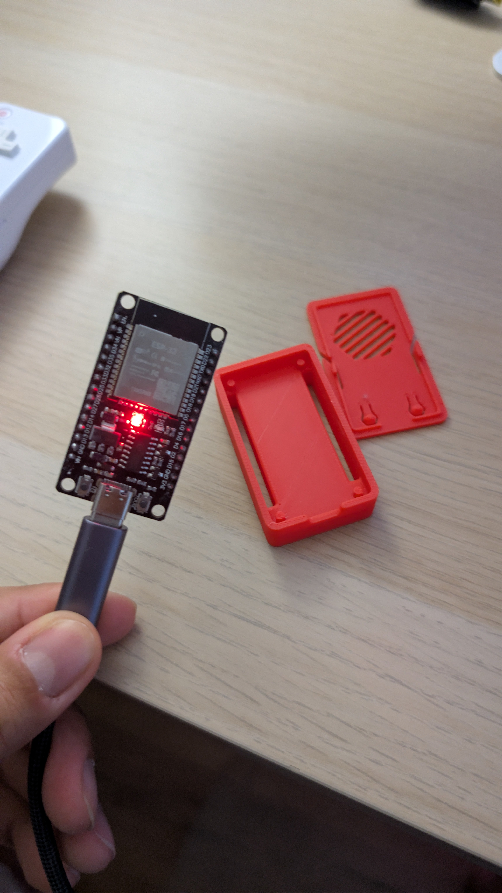

In a [previous article](https://dev.to/andremmfaria/improving-the-esp32-wiimote-library-from-prototype-to-production-ready-arduino-library-448e), I wrote about improving the ESP32 Wiimote library. That work made it possible to treat a Nintendo Wii Remote as a cleaner ESP32 input device, with better examples, runtime logging, connection state, battery reporting, and Arduino Library Manager support.

The real reason for doing it was a Home Assistant controller. Not another dashboard, not another app, but a physical object with real buttons that can sit on a table and trigger automations without unlocking a phone or negotiating with a voice assistant.

That also makes it a useful child-facing interface. No screen, no app drawer, no voice prompt. Just a familiar object with buttons that map to a few safe actions in the house. Pediatric guidance on [media and young minds](https://pubmed.ncbi.nlm.nih.gov/27940793/) treats screen use as something to design deliberately, not as the default surface for every interaction.

The shape is simple.

```text
Wii Remote -> Bluetooth Classic ESP32 -> USB serial Home Assistant add-on -> MQTT Home Assistant automations
```

The ESP32 handles the awkward Bluetooth side. Home Assistant handles the useful automation side. MQTT sits between them as the boring, reliable contract. That split is the design decision everything else follows from.



## 1. Why a Wii Remote Makes Sense

A Wii Remote is an odd thing to put in a home automation system, but only if you think of it as a game controller. If you look at it as a cheap wireless input device, it starts to make more sense. It has a useful collection of inputs and sensors like physical buttons (A, B, plus, minus, home, one and two), a familiar handheld shape, Bluetooth, battery power, accelerometer hardware for gesture work.

Most smart home controls are either too abstract or too fragile. Phones are powerful, but they are not good shared controls. Voice assistants are convenient until they mishear you, lose context, or need the cloud to be in a good mood. Wall switches are reliable, but fixed. A Wii Remote sits in a useful middle ground because it is physical, cheap, wireless, programmable, and already designed to be held without looking at it. The buttons are distinct enough that you can build muscle memory around them. For some automations, that matters more than having a beautiful UI.

For children, that physicality matters even more. A Wii Remote is easy to hold, forgiving, and legible in a way a touchscreen often is not. That intuition has some backing in HCI work on [tangible interaction for children&#39;s creative learning](https://www.mmi.ifi.lmu.de/pubdb/publications/pub/liyanhong2021cc/liyanhong2021cc.pdf). Physical objects can make digital behavior feel more immediate and exploratory.

For example, a practical mapping could look like this:

* `A` toggles a light
* `B` turns everything in a room off
* `PLUS` increases media volume
* `MINUS` decreases media volume
* `HOME` activates a scene
* the D-pad controls media playback or dashboard navigation

The mappings can be child-sized too. One button for lights, one for music, one for a bedtime scene. The point is not to expose the whole smart home, but to give a child a few safe, predictable actions, closer to a [tangible interface](https://dl.acm.org/doi/10.1145/1226969.1227004) than another miniature dashboard.

This is not meant to replace every Home Assistant interface. It is meant to be one small, reliable interaction surface. Sometimes the best UI is a button that does exactly one thing.

## 2. The Hardware Boundary

The firmware runs on an [ESP32-WROOM-32 development board](https://www.amazon.co.uk/dp/B0DGLCWR76) connected to the Home Assistant host over USB. The key requirement is Bluetooth Classic support because the Wii Remote uses [Bluetooth Classic HID](https://www.bluetooth.com/specifications/specs/human-interface-device-profile-1-1-1/). Some newer or smaller ESP32-family boards focus on Wi-Fi and BLE, so this detail matters. Espressif’s [ESP32-DevKitC page](https://www.espressif.com/en/products/devkits/esp32-devkitc) is the useful manufacturer reference for this class of board.

The hardware list is deliberately short.

* one [ESP32-WROOM-32 development board](https://www.amazon.co.uk/dp/B0DGLCWR76)
* one [Wii-compatible remote controller](https://www.amazon.co.uk/CLVIZCXOM-Replacement-Controller-Compatible-Nintendo/dp/B0DX1R4QT4)
* one USB cable that carries data, not only power
* a Home Assistant host with add-on support
* an MQTT broker, usually the official [Mosquitto broker add-on](https://github.com/home-assistant/addons/tree/master/mosquitto)



The ESP32 does not need Wi-Fi for this project. That was intentional. It would be possible to make the ESP32 publish MQTT directly, but then the firmware would also own Wi-Fi setup, MQTT configuration, reconnect behavior, TLS decisions, and broker behavior. That is too much for a device whose real job is already tricky enough.

Instead, the ESP32 stays narrow. It pairs with the Wii Remote, reads controller state, and writes JSON lines to USB serial.

```text
Bluetooth input -> serial events
```

Everything network-related stays on the Home Assistant side, where it is easier to observe, configure, update, and recover. The hardware boundary is also the responsibility boundary.

## 3. The ESP32 Firmware

The firmware lives in the bridge repository under this path:

```text
esp32/wiimote-serial-bridge/
```

The full build, flash, and serial validation steps are documented in the bridge repository's [firmware setup guide](https://github.com/andremmfaria/ha-wiimote-bridge/blob/main/docs/firmware-setup.md), so I will not duplicate them here. It uses the improved `ESP32Wiimote` library from the [previous article](https://dev.to/andremmfaria/improving-the-esp32-wiimote-library-from-prototype-to-production-ready-arduino-library-448e).

```shell
arduino-cli lib install ESP32Wiimote
```

The firmware itself is not complicated, and that is one of its strengths. On startup it does five things.

1. starts serial at `115200`
2. initializes the Wiimote library
3. reduces library logging to warnings and errors
4. emits a firmware-ready message
5. prompts the user to pair the Wii Remote

Pairing is the standard Wii Remote flow. Press `1 + 2`. And when it connects, the firmware emits this status message.

```json
{"type":"status","wiimote":1,"connected":true}
```

Button transitions are emitted as JSON too.

```json
{"type":"btn","wiimote":1,"btn":"A","down":true}
{"type":"btn","wiimote":1,"btn":"A","down":false}
```

Battery changes are emitted when known.

```json
{"type":"battery","wiimote":1,"level":87}
```

And every ten seconds the firmware emits a heartbeat.

```json
{"type":"heartbeat","device":"esp32","wiimote":1,"connected":true,"battery":87}
```

<!-- markdownlint-disable MD033 -->
<video controls muted playsinline>
  <source src="https://raw.githubusercontent.com/andremmfaria/articles/main/articles/Turning%20a%20Wii%20Remote%20into%20a%20Home%20Assistant%20Controller%20with%20ESP32/wiimote-serial-json-demo.mp4" type="video/mp4">
</video>
<!-- markdownlint-enable MD033 -->

The protocol is line-delimited JSON. One object per line. That makes it easy to debug with a serial monitor before Home Assistant is involved. When an integration spans Bluetooth, firmware, USB, containers, MQTT, and automations, being able to isolate one boundary saves a lot of guessing.

One small firmware detail is worth calling out because it is the kind of thing that makes prototypes feel haunted. When the Wii Remote first connects, the firmware does not immediately emit button events from the first packet. It captures that first observed state as a baseline. Only after that does it emit transitions. The reason is simple. On connection, you do not want the first read to look like a meaningful change if it is only the controller settling into its initial state. A real automation system should not turn on a light because a Bluetooth controller happened to reconnect.

The firmware loop is built around that distinction.

```cpp
if (!baselineCaptured) {
  lastButtons = buttons;
  baselineCaptured = true;
} else {
  emitButtonsChanged(buttons);
}
```

This is the difference between "I can read a button" and "I trust this enough to let it touch the house". The same philosophy appears elsewhere.

* connection changes are explicit status messages
* heartbeat messages prove the firmware is still alive
* battery updates are separate from button events
* waiting messages are emitted while no controller is connected

The firmware does not need to know what the `A` button does. It only needs to report, accurately and predictably, that `A` was pressed or released.

## 4. The Home Assistant Add-on

Once the ESP32 has reduced the controller to a serial event stream, the Home Assistant side can stay ordinary. The other half of the project is a Home Assistant add-on called [**WiiMote Bridge**](https://github.com/andremmfaria/ha-wiimote-bridge). It is a Python application packaged as an add-on container. Its job is to read the ESP32 serial stream and publish MQTT messages that Home Assistant can consume.

The add-on configuration looks like this:

```yaml
radios:
  - port: /dev/ttyUSB0
    baud: 115200
    controller_id: 1
mqtt:
  host: core-mosquitto
  port: 0
  username: ""
  password: ""
  transport: tcp
  ssl: false
  ssl_insecure: false
  topic_prefix: wiimote
  discover_enabled: true
log_level: info
```

Each `radios` entry represents one ESP32 connected to the Home Assistant host. The `controller_id` becomes part of the MQTT topic path.

For example, controller `1` publishes under this prefix:

```text
wiimote/1/...
```

The add-on opens the serial port, reads each line, parses the JSON, and maps it to MQTT.

A firmware button message like this:

```json
{"type":"btn","wiimote":1,"btn":"A","down":true}
```

becomes this MQTT publication:

```text
topic: wiimote/1/button/A
payload: ON
```

The matching release becomes this one:

```text
topic: wiimote/1/button/A
payload: OFF
```

At this point the Wiimote has become a predictable Home Assistant input. Subscribe to a topic and react to `ON`.

## 5. MQTT as the Contract

[MQTT](https://docs.oasis-open.org/mqtt/mqtt/v5.0/mqtt-v5.0.html) is not glamorous, which is one of its better qualities. For this project, it gives the bridge a stable interface that is usable by Home Assistant but not trapped inside Home Assistant. Anything that can consume MQTT can consume the Wii Remote events.

The bridge publishes several topic families.

```text
wiimote/1/button/A
wiimote/1/button/B
wiimote/1/button/PLUS
wiimote/1/status/connected
wiimote/1/status/heartbeat
wiimote/1/status/battery
wiimote/1/events/status
wiimote/device/esp32/events/status
```

There are two styles here. The first style is convenience topics, optimized for automations.

```text
wiimote/1/button/A -> ON
wiimote/1/status/battery -> 87
wiimote/1/status/connected -> true
```

The second style is passthrough event topics. Every valid firmware JSON message is forwarded as JSON under an event topic.

```text
wiimote/1/events/btn
wiimote/1/events/status
wiimote/1/events/battery
```

That means newer firmware events can still be observed even before the add-on grows a dedicated high-level topic for them. This keeps the protocol extensible without making the first working version too broad.

## 6. Home Assistant Discovery, Automations, and Scaling

Raw MQTT automations are enough to make the bridge useful immediately.

```yaml
alias: Toggle living room light from Wii Remote A
trigger:
  - platform: mqtt
    topic: wiimote/1/button/A
    payload: "ON"
action:
  - service: light.toggle
    target:
      entity_id: light.living_room
mode: single
```

That works, but a good Home Assistant integration should also feel native once it is installed. The add-on supports MQTT Discovery and publishes retained discovery topics so Home Assistant creates entities automatically.

* one connection binary sensor per controller
* one battery sensor per controller
* one binary sensor per supported button

That means the Wii Remote shows up in Home Assistant as something you can inspect, not just a pile of hidden MQTT topics. The discovery payloads are retained and republished after MQTT reconnects, which matters because Home Assistant, the broker, and the add-on are separate processes.

Once the ESP32 is flashed and the add-on is running, the working loop is direct. Press `1 + 2` on the Wii Remote, let the controller connect to the ESP32, watch the add-on log the status, then let MQTT and Home Assistant react to the button topics.

<!-- markdownlint-disable MD033 -->
<video controls muted playsinline>
  <source src="https://raw.githubusercontent.com/andremmfaria/articles/main/articles/Turning%20a%20Wii%20Remote%20into%20a%20Home%20Assistant%20Controller%20with%20ESP32/wiimote-home-assistant-living-room-demo.mp4" type="video/mp4">
</video>
<!-- markdownlint-enable MD033 -->

For common mappings, the repository ships a Home Assistant automation blueprint.

```text
blueprints/automation/wiimote_common.yaml
```

The blueprint exposes actions for common buttons such as `A`, `HOME` and `PLUS`. The pattern I like looks like this:

```text
A     -> toggle the local light
HOME  -> activate the room default scene
PLUS  -> media volume up
MINUS -> media volume down
B     -> turn the room off
```

The exact mapping is personal. The important part is that Home Assistant sees the Wii Remote as a stream of deterministic events. Once it is an event stream, it can do anything Home Assistant can do.

Scaling is straightforward. The current ESP32 Wiimote stack is effectively one controller per ESP32 radio. That is not elegant in the abstract, but it is robust in the real world. The add-on supports multiple radios in a single instance.

```yaml
radios:
  - port: /dev/ttyUSB0
    baud: 115200
    controller_id: 1
  - port: /dev/ttyUSB1
    baud: 115200
    controller_id: 2
```

Each ESP32 gets its own serial reader thread and its own controller ID. MQTT topics stay separated.

```text
wiimote/1/button/A
wiimote/2/button/A
```

A Wii Remote in the living room and a Wii Remote in the office do not need to share state or identity. Could the firmware eventually support multiple controllers on one ESP32? Unfortunately no. Classic HID makes that a one-radio, one-device story. For this project, one cheap ESP32 per Wii Remote is the cleaner path.

## 7. Failure Modes and Recovery

Because the full system crosses several boundaries, recovery behavior matters. The project is designed to make common failures visible.

* if the ESP32 boots, it emits a `ready` status
* if the Wii Remote is not connected, it emits waiting and pairing hints
* if the Wii Remote disconnects, it emits `connected: false`
* if the serial device disappears, the add-on retries
* if MQTT reconnects, discovery is republished
* if button events are visible but entities are missing, retained discovery topics can be inspected

The most common setup issue is usually the wrong serial device path. On Home Assistant OS, the ESP32 normally appears as `/dev/ttyUSB0`, `/dev/ttyUSB1`, or `/dev/ttyACM0`.

The second common issue is a charge-only USB cable. It powers the ESP32 but creates no serial device, which looks almost like success until you try to read from it.

The third common issue is MQTT configuration. The add-on defaults are meant to work with the official [Mosquitto broker add-on](https://github.com/home-assistant/addons/tree/master/mosquitto). If you run MQTT elsewhere, the host, authentication, transport, and TLS settings need to match that broker. None of this is exotic. That is good. The failure modes are boring enough to diagnose.

## Conclusion

The previous ESP32Wiimote work made the library usable as a foundation. This project turns that foundation into an actual Home Assistant input device. The final architecture stays deliberately split.

```text
Wii Remote -> ESP32 firmware -> USB serial JSON -> Home Assistant add-on -> MQTT -> automations
```

That separation keeps the ESP32 firmware small, keeps Bluetooth away from Home Assistant, and gives the automation layer a simple MQTT contract. The bridge currently focuses on button events, connection state, heartbeat, and battery. That is enough to make it useful.

The Wii Remote still has more hardware available. Accelerometer topics, gesture events, commands back to the firmware, rumble control, LED control, and richer blueprints are obvious next steps. The accelerometer is the most interesting, but also the easiest one to overdo. Raw data is noisy, and a useful gesture layer needs thresholds, timing, and restraint.

For now, buttons are the correct foundation. Buttons are boring. Buttons work.

The follow-up project is available here. [ha-wiimote-bridge](https://github.com/andremmfaria/ha-wiimote-bridge)

The improved ESP32 Wiimote library is here. [ESP32Wiimote](https://github.com/andremmfaria/ESP32Wiimote)

It is a slightly ridiculous project, but in the useful way. An old game controller, a cheap ESP32, and a few lines of MQTT can become a real physical interface for a smart home. That is the kind of ridiculous I can defend.
